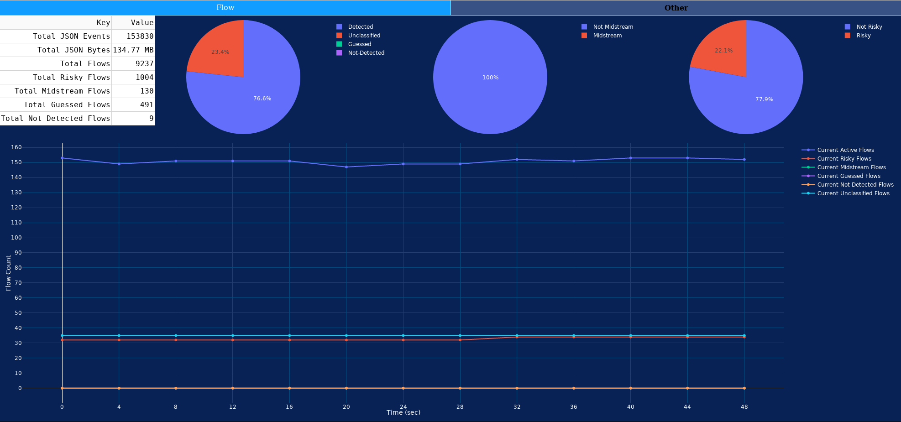

[](https://github.com/utoni/nDPId/actions/workflows/build.yml)
[](https://gitlab.com/utoni/nDPId/-/pipelines)

# abstract

nDPId is a set of daemons and tools to capture, process and classify network flows.
It's only dependencies (besides a half-way modern c library and POSIX threads) are libnDPI (>= 4.2.0 or current github dev branch) and libpcap.

The core daemon nDPId uses pthread but does use mutexes for performance reasons.
Instead synchronization is achieved by a packet distribution mechanism.
To balance all workload to all threads (more or less) equally a hash value is calculated using the 5-tuple.
This value serves as unique identifier for the processing thread. Multithreaded packet processing has to be flow-stable.

nDPId uses libnDPI's JSON serialization to produce meaningful JSON output which it then sends to the nDPIsrvd for distribution.
High level applications can connect to nDPIsrvd to get the latest flow/packet events from nDPId.

Unfortunately nDPIsrvd does currently not support any encryption/authentication for TCP connections.

# architecture

This project uses some kind of microservice architecture.

```text
                connect to UNIX socket          connect to UNIX/TCP socket                
_______________________   |                                 |   __________________________
|     "producer"      |___|                                 |___|       "consumer"       |
|---------------------|      _____________________________      |------------------------|
|                     |      |        nDPIsrvd           |      |                        |
| nDPId --- Thread 1 >| ---> |>           |             <| ---> |< example/c-json-stdout |
| (eth0) `- Thread 2 >| ---> |> collector | distributor <| ---> |________________________|
|        `- Thread N >| ---> |>    >>> forward >>>      <| ---> |                        |
|_____________________|  ^   |____________|______________|   ^  |< example/py-flow-info  |
|                     |  |                                   |  |________________________|
| nDPId --- Thread 1 >|  `- send serialized data             |  |                        |
| (eth1) `- Thread 2 >|                                      |  |< example/...           |
|        `- Thread N >|             receive serialized data -'  |________________________|
|_____________________|                                                                   
```

It doesn't use a producer/consumer design pattern, so the wording is not precise.

# JSON TCP protocol

All JSON strings sent need to be in the following format:
```text
[5-digit-number][JSON string]
```

## Example:

```text
00015{"key":"value"}
```
where `00015` describes the length (as decimal number) of the **entire** JSON string including the newline `\n` at the end.

A common sequence of received JSON strings could look alike (simplified):
```text
00070{"flow_event_id":1,"flow_event_name":"new","packet_id":1,"flow_id":1}
00101{"flow_id":1,"flow_packet_id":1,"packet_event_id":2,"packet_event_name":"packet-flow","packet_id":1}
00075{"flow_event_id":5,"flow_event_name":"detected","packet_id":4,"flow_id":1}
00093{"flow_event_id":2,"flow_event_name":"end","packet_id":258,"flow_id":1,"flow_packet_id":258}
```

# build (CMake)

```shell
mkdir build
cd build
cmake ..
```

or

```shell
mkdir build
cd build
ccmake ..
```

or to build with a staticially linked libnDPI:

```shell
mkdir build
cd build
cmake .. -DSTATIC_LIBNDPI_INSTALLDIR=[path/to/your/libnDPI/installdir]
```

If you're using the latter one, make sure that you've configured libnDPI with `./configure --prefix=[path/to/your/libnDPI/installdir]`
and do not forget to set the all necessary CMake variables to link against shared libraries used by your nDPI build.

e.g.:

```shell
mkdir build
cd build
cmake .. -DSTATIC_LIBNDPI_INSTALLDIR=[path/to/your/libnDPI/installdir] -DNDPI_WITH_GCRYPT=ON -DNDPI_WITH_PCRE=OFF -DNDPI_WITH_MAXMINDDB=OFF
```

Or if this is all too much for you, let CMake do it for you:

```shell
mkdir build
cd build
cmake .. -DBUILD_NDPI=ON
```

# run

Generate a nDPId compatible JSON dump:
```shell
./nDPId-test [path-to-a-PCAP-file]
```

Daemons:
```shell
./nDPIsrvd -d
sudo ./nDPId -d
```

or for a usage printout:
```shell
./nDPIsrvd -h
./nDPId -h
```

And why not a flow-info example?
```shell
./examples/py-flow-info/flow-info.py
```

or
```shell
./nDPIsrvd-json-dump
```

or anything below `./examples`.

# test

The recommended way to run integration / diff tests:

```shell
mkdir build
cd build
cmake .. -DBUILD_NDPI=ON
make nDPId-test test
```

Alternatively you can run some integration tests manually:

`./test/run_tests.sh [/path/to/libnDPI/root/directory] [/path/to/nDPId-test]`

e.g.:

`./test/run_tests.sh [${HOME}/git/nDPI] [${HOME}/git/nDPId/build/nDPId-test]`

Remember that all test results are tied to a specific libnDPI commit hash
as part of the `git submodule`. Using `test/run_tests.sh` for other commit hashes
will most likely result in PCAP diff's.

Why not use `examples/py-flow-dashboard/flow-dash.py` to visualize nDPId's output:


