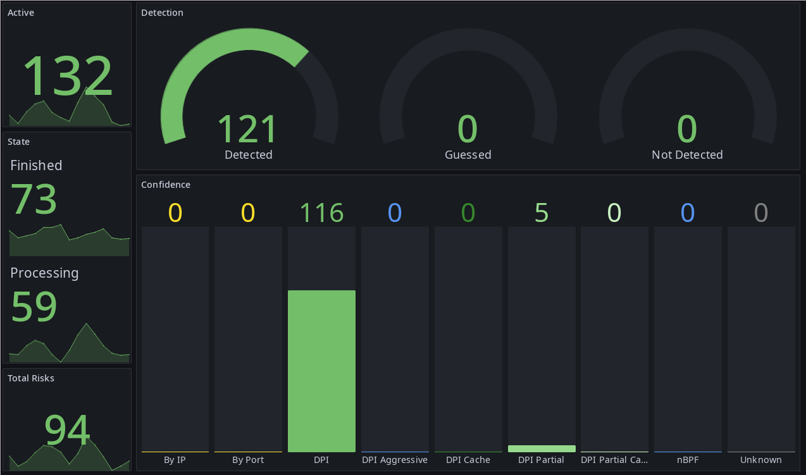

# examples

Some ready-2-use/ready-2-extend examples/utils.
All examples are prefixed with their used LANG.

## c-analysed

A feature extractor useful for ML/DL use cases.
It generates CSV files from flow "analyse" events.
Used also by `tests/run_tests.sh` if available.

## c-captured

A capture daemon suitable for low-resource devices.
It saves flows that were guessed/undetected/risky/midstream to a PCAP file for manual analysis.
Used also by `tests/run_tests.sh` if available.

## c-collectd

A collecd-exec compatible middleware that gathers statistic values from nDPId.
Used also by `tests/run_tests.sh` if available.

## c-influxd

An InfluxDB push daemon. It aggregates various statistics gathered from nDPId.
The results are sent to a specified InfluxDB endpoint.

## c-notifyd

A notification daemon that sends information about suspicious flow events to DBUS.

## c-simple

Integration example that verifies flow timeouts on SIGUSR1.

## cxx-graph

A standalone GLFW/OpenGL application that draws statistical data using ImWeb/ImPlot/ImGui.

## js-rt-analyzer

[nDPId-rt-analyzer](https://gitlab.com/verzulli/ndpid-rt-analyzer.git)

## js-rt-analyzer-frontend

[nDPId-rt-analyzer-frontend](https://gitlab.com/verzulli/ndpid-rt-analyzer-frontend.git)

## py-flow-info

Console friendly, colorful, prettyfied event printer.
Required by `tests/run_tests.sh`

## py-machine-learning

Contains:

1. Classification via Random Forests and SciLearn
2. Anomaly Detection via Autoencoder and Keras (Work-In-Progress!)

Use sklearn together with CSVs created with **c-analysed** to train and predict DPI detections.

Try it with: `./examples/py-machine-learning/sklearn_random_forest.py --csv ./ndpi-analysed.csv --proto-class tls.youtube --proto-class tls.github --proto-class tls.spotify --proto-class tls.facebook --proto-class tls.instagram --proto-class tls.doh_dot --proto-class quic --proto-class icmp`

This way you should get 9 different classification classes.
You may notice that some classes e.g. TLS protocol classifications have a higher false-negative/false-positive rate.
Unfortunately, I can not provide any datasets due to some privacy concerns.

But you may use a [pre-trained model](https://drive.google.com/file/d/1KEwbP-Gx7KJr54wNoa63I56VI4USCAPL/view?usp=sharing) with `--load-model`.

## py-flow-dashboard

A realtime web based graph using Plotly/Dash.
Probably the most informative example.

## py-flow-multiprocess

Simple Python Multiprocess example spawning two worker processes, one connecting to nDPIsrvd and one printing flow id's to STDOUT.

## py-json-stdout

Dump received and parsed JSON objects.

## py-schema-validation

Validate nDPId JSON messages against pre-defined JSON schema's.
See `schema/`.
Required by `tests/run_tests.sh`

## py-semantic-validation

Validate nDPId JSON messages against internal event semantics.
Required by `tests/run_tests.sh`

## yaml-filebeat
An example filebeat configuration to parse and send nDPId JSON 
messages to Elasticsearch. Allowing long term storage and data visualization with kibana
and various other tools that interact with Elasticsearch (No logstash required).